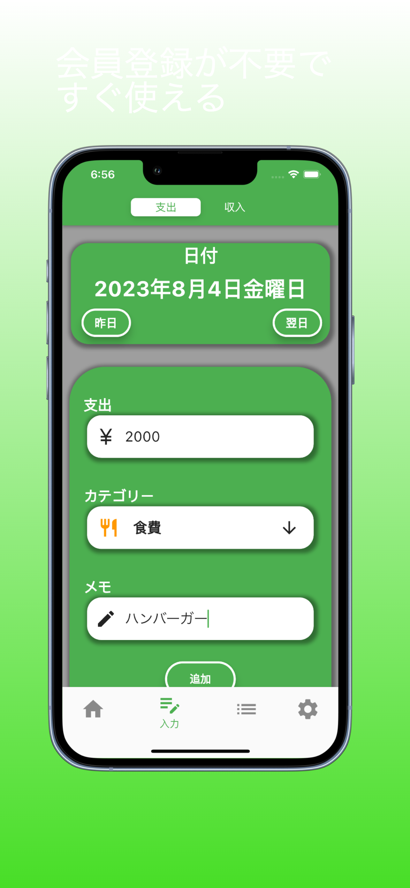
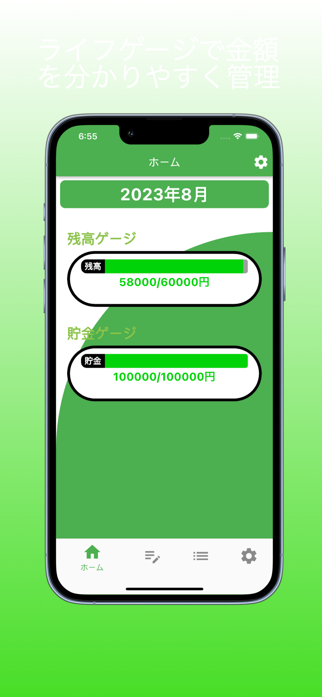
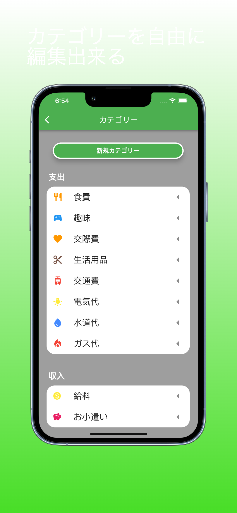
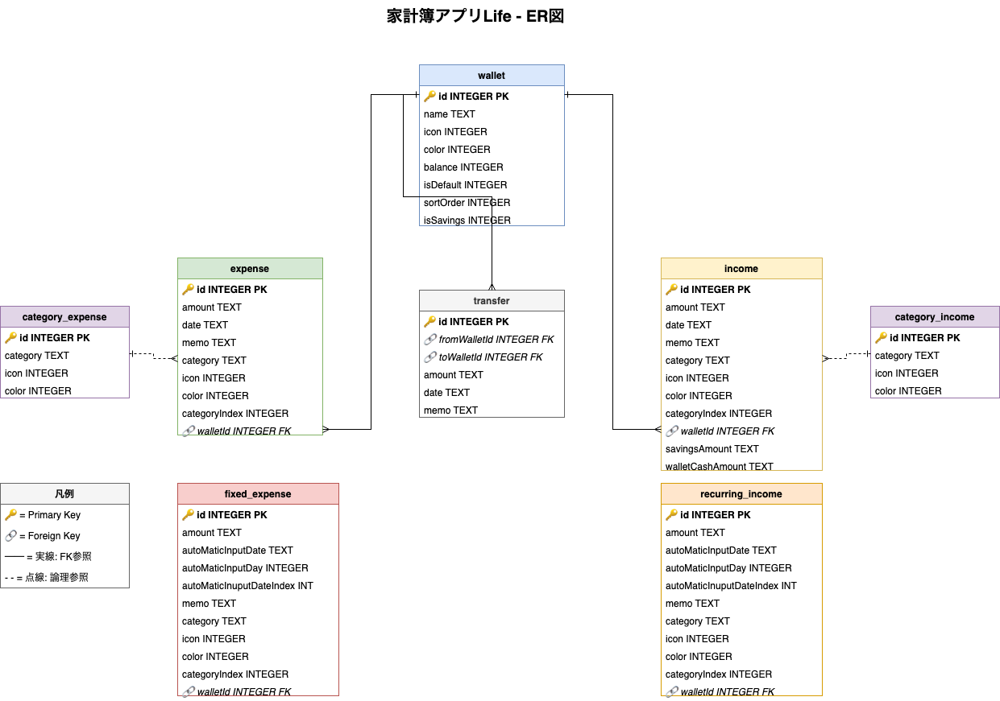
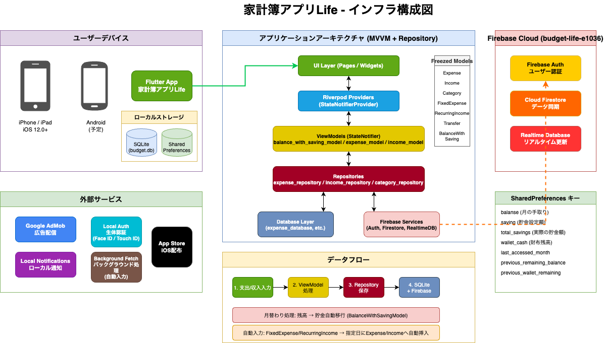

# 家計簿アプリLife

ゲームのHPゲージのように、お金の状況を一目で理解できる家計簿アプリです。

[](https://apps.apple.com/jp/app/id6457262696)
[](https://flutter.dev)
[](https://firebase.google.com)

---

## 目次

- [コンセプト](#コンセプト)
- [スクリーンショット](#スクリーンショット)
- [機能一覧](#機能一覧)
- [技術スタック](#技術スタック)
- [アーキテクチャ](#アーキテクチャ)
- [ER図](#er図)
- [インフラ構成図](#インフラ構成図)
- [セットアップ](#セットアップ)
- [ビルド方法](#ビルド方法)
- [ディレクトリ構造](#ディレクトリ構造)
- [データフロー](#データフロー)
- [注意事項](#注意事項)

---

## コンセプト

### ライフゲージで直感的に把握

従来の家計簿アプリは数字の羅列で分かりにくいという課題がありました。本アプリは**ライフゲージ**という視覚的なUIで、残高状況を直感的に把握できます。

| 状態 | ゲージの色 | 意味 |
|------|-----------|------|
| 十分 | 緑色 | 余裕があります |
| 半分 | 黄色 | 注意が必要です |
| 少ない | 赤色 | 危険！節約しましょう |

### 3つのゲージで管理

1. **残高ゲージ** - 今月使えるお金の残り
2. **貯金ゲージ** - 貯金の状況
3. **財布ゲージ** - 手元の現金

---

## スクリーンショット

<p align="center">
  
  
  
</p>

---

## 機能一覧

### 基本機能

| 機能 | 説明 |
|------|------|
| ライフゲージ | 残高・貯金・財布の状況を色分けゲージで表示 |
| 支出記録 | 金額・カテゴリ・メモを入力して支出を記録 |
| 収入記録 | 収入を記録し、貯金・財布への分配も可能 |
| カテゴリ管理 | 支出・収入のカテゴリをカスタマイズ |
| 履歴一覧 | 日付別に支出・収入の履歴を確認 |

### 自動化機能

| 機能 | 説明 |
|------|------|
| 固定支出 | 家賃・サブスク等を指定日に自動入力 |
| 定期収入 | 給与等を指定日に自動入力 |
| 月替わり処理 | 月が変わると残高を自動で貯金に移行 |

### 分析機能

| 機能 | 説明 |
|------|------|
| 円グラフ | カテゴリ別の支出・収入を可視化 |
| 月別推移 | 月ごとの収支を確認 |

### セキュリティ機能

| 機能 | 説明 |
|------|------|
| パスコード | 4桁のパスコードでアプリをロック |
| 生体認証 | Face ID / Touch ID に対応 |

### クラウド機能

| 機能 | 説明 |
|------|------|
| アカウント登録 | Firebase Authでユーザー認証 |
| データ同期 | 複数端末間でデータを同期 |
| バックアップ | クラウドにデータを自動バックアップ |

---

## 技術スタック

### フレームワーク・言語

| 技術 | バージョン | 用途 |
|------|-----------|------|
| Flutter | 3.x | クロスプラットフォームUI |
| Dart | >=3.0.6 <4.0.0 | プログラミング言語 |

### 状態管理

| パッケージ | 用途 |
|-----------|------|
| Riverpod | 状態管理・DI |
| Freezed | 不変データクラス生成 |
| Flutter Hooks | Reactライクなフック |

### データベース

| 技術 | 用途 |
|------|------|
| SQLite (sqflite) | ローカルデータ保存 |
| SharedPreferences | 設定・状態の保存 |
| Cloud Firestore | クラウドデータ同期 |
| Realtime Database | リアルタイム更新 |

### 認証・セキュリティ

| 技術 | 用途 |
|------|------|
| Firebase Auth | ユーザー認証 |
| Local Auth | 生体認証（Face ID / Touch ID） |

### UI・UX

| パッケージ | 用途 |
|-----------|------|
| Flutter ScreenUtil | レスポンシブデザイン |
| Flutter Slidable | スワイプアクション |
| Grouped List | グループ化リスト |
| Pie Chart | 円グラフ表示 |

### その他

| パッケージ | 用途 |
|-----------|------|
| Flutter Local Notifications | ローカル通知 |
| Google Mobile Ads | 広告配信 |
| Background Fetch | バックグラウンド処理 |

---

## アーキテクチャ

本アプリは **MVVM + リポジトリパターン** を採用し、**Riverpod** で状態管理を行っています。

```
┌─────────────────────────────────────────────────────────────┐
│                        UI Layer                             │
│                   (Pages / Widgets)                         │
│         ユーザーインターフェース・画面表示                    │
└─────────────────────────────────────────────────────────────┘
                              ↓ ↑
┌─────────────────────────────────────────────────────────────┐
│                    Riverpod Providers                       │
│              (StateNotifierProvider)                        │
│              状態の提供・依存性注入                          │
└─────────────────────────────────────────────────────────────┘
                              ↓ ↑
┌─────────────────────────────────────────────────────────────┐
│                      ViewModels                             │
│                   (StateNotifier)                           │
│              ビジネスロジック・状態変更                       │
└─────────────────────────────────────────────────────────────┘
                              ↓ ↑
┌─────────────────────────────────────────────────────────────┐
│                     Repositories                            │
│               データアクセスの抽象化                         │
└─────────────────────────────────────────────────────────────┘
                              ↓ ↑
┌─────────────────────────────────────────────────────────────┐
│                      Data Layer                             │
│              (SQLite / Firebase / Preferences)              │
│                    データの永続化                            │
└─────────────────────────────────────────────────────────────┘
```

### 各レイヤーの責務

| レイヤー | ファイル | 責務 |
|---------|---------|------|
| UI | `lib/page/`, `lib/widgets/` | 画面表示・ユーザー操作 |
| Provider | `lib/provider/` | 状態の提供・DI |
| ViewModel | `lib/viewModels/` | ビジネスロジック |
| Repository | `lib/repositorys/` | データアクセス抽象化 |
| Database | `lib/datebases/` | SQLite操作 |
| Model | `lib/model/` | データ構造定義 |
| State | `lib/states/` | 状態クラス |

---

## ER図

データベースのテーブル構造とリレーションを示します。



### テーブル概要

| テーブル | 説明 |
|---------|------|
| `wallet` | ウォレット（財布・銀行口座）の管理 |
| `expense` | 支出記録 |
| `income` | 収入記録 |
| `category_expense` | 支出カテゴリマスタ |
| `category_income` | 収入カテゴリマスタ |
| `fixed_expense` | 固定支出（自動入力設定） |
| `recurring_income` | 定期収入（自動入力設定） |

### SharedPreferences キー

ゲージの状態管理に使用するキーです。

| キー | 説明 |
|------|------|
| `balanse` | 月の手取り（残高ゲージの最大値） |
| `saving` | 貯金設定額（貯金ゲージの最大値） |
| `total_savings` | 実際の貯金額（貯金ゲージの現在値） |
| `wallet_cash` | 財布の設定額 |
| `last_accessed_month` | 前回アクセス月（月替わり判定用） |

---

## インフラ構成図

アプリ全体のインフラ構成を示します。



---

## セットアップ

### 必要な環境

- Flutter SDK 3.x 以上
- Dart SDK 3.0.6 以上
- Xcode 14 以上（iOS開発の場合）
- CocoaPods（iOS依存関係管理）

### 手順

#### 1. リポジトリをクローン

```bash
git clone <repository-url>
cd budget_life
```

#### 2. 依存関係をインストール

```bash
flutter pub get
```

#### 3. コード生成（Freezed）

モデルクラスはFreezedで自動生成されます。

```bash
flutter pub run build_runner build --delete-conflicting-outputs
```

#### 4. iOS依存関係をインストール

```bash
cd ios
pod install
cd ..
```

#### 5. アプリを実行

```bash
flutter run
```

---

## ビルド方法

### 開発ビルド

```bash
# iOS シミュレータで実行
flutter run

# 特定のデバイスで実行
flutter run -d <device-id>
```

### リリースビルド

```bash
# iOS リリースビルド
flutter build ios --release --no-tree-shake-icons

# Android リリースビルド（APK）
flutter build apk --release

# Android リリースビルド（App Bundle）
flutter build appbundle --release
```

### その他のコマンド

```bash
# 静的解析
flutter analyze

# テスト実行
flutter test

# クリーンビルド
flutter clean && flutter pub get
```

---

## ディレクトリ構造

```
lib/
├── main.dart                 # アプリのエントリーポイント
│
├── background/               # バックグラウンド処理
│   └── background_service.dart
│
├── datebases/                # SQLiteデータベース操作
│   ├── datebase_helper.dart      # DB初期化・マイグレーション
│   ├── expense_database.dart     # 支出テーブル操作
│   ├── income_database.dart      # 収入テーブル操作
│   ├── category_expense_database.dart
│   ├── category_income_database.dart
│   ├── fixed_expense_database.dart
│   └── recurring_income_database.dart
│
├── firebase_auth/            # Firebase認証
│   └── auth_service.dart
│
├── model/                    # データモデル（Freezed）
│   ├── expense/expense.dart
│   ├── income/income.dart
│   ├── category/category.dart
│   ├── fixed_expense/fixed_expense.dart
│   ├── recurring_income/recurring_income.dart
│   └── balance_with_saving/balance_with_saving.dart
│
├── notifications/            # ローカル通知
│   └── notification_service.dart
│
├── page/                     # 画面（UI）
│   ├── home/                     # ホーム画面（ライフゲージ表示）
│   ├── expense/                  # 支出入力・編集
│   ├── income/                   # 収入入力・編集
│   ├── list/                     # 履歴一覧
│   ├── chart/                    # グラフ・分析
│   ├── setting/                  # 設定
│   ├── category/                 # カテゴリ設定
│   ├── fixed_expense/            # 固定支出設定
│   ├── recurring_income/         # 定期収入設定
│   ├── balance_saving/           # 残高・貯金設定
│   └── passcode/                 # パスコード設定
│
├── provider/                 # Riverpodプロバイダ
│   ├── shared_preferences_provider.dart
│   └── firebase_provider.dart
│
├── repositorys/              # リポジトリ層
│   ├── expense_repository.dart
│   ├── income_repository.dart
│   └── category_repository.dart
│
├── states/                   # 状態クラス（Freezed）
│   ├── expense_state.dart
│   ├── income_state.dart
│   └── category_state.dart
│
├── viewModels/               # ViewModel（StateNotifier）
│   ├── balance_with_saving_model.dart  # ゲージ状態管理
│   ├── expense_model.dart
│   ├── income_model.dart
│   └── category_model.dart
│
├── widgets/                  # 再利用可能なUIコンポーネント
│   ├── hp_gauge3_color.dart      # ライフゲージウィジェット
│   ├── wallet_balance_card.dart  # 財布残高カード
│   └── category_bottom_sheet_bar.dart
│
└── utils/                    # ユーティリティ
    ├── util.dart
    └── balance_calculator.dart   # 残高計算ロジック
```

---

## データフロー

### 支出・収入入力時の流れ

```
ユーザー入力
    ↓
Page（UI）で入力値を取得
    ↓
ViewModel.add() を呼び出し
    ↓
Repository.add() でデータを保存
    ↓
SQLite + Firebase に永続化
    ↓
State を更新
    ↓
Riverpod が UI に通知
    ↓
ライフゲージが更新される
```

### 月替わり処理の流れ

```
アプリ起動
    ↓
BalanceWithSavingModel が月をチェック
    ↓
前月と異なる場合：
    ├── 前月の残高を貯金に移行
    ├── 前月の財布残高を貯金に移行
    └── 財布残高をリセット
    ↓
今月の残高を計算
    ↓
ゲージに反映
```

---

## 注意事項

### 開発時の注意

1. **コード生成が必要**
   - `model/` のファイルを変更した場合は、以下を実行してください。
   ```bash
   flutter pub run build_runner build --delete-conflicting-outputs
   ```

2. **ディレクトリ名のtypo**
   - 一部のディレクトリ名にtypoがあります（歴史的経緯）。
   - `datebases` → 正しくは `databases`
   - `repositorys` → 正しくは `repositories`

3. **iOSビルド時のオプション**
   - アイコンが動的に生成されるため、以下のフラグが必要です。
   ```bash
   flutter build ios --release --no-tree-shake-icons
   ```

### 対応プラットフォーム

| プラットフォーム | 対応状況 |
|-----------------|---------|
| iOS | 対応（iOS 12.0以上） |
| Android | 対応予定 |
| Web | 未対応 |

---

## プロジェクト情報

| 項目 | 内容 |
|------|------|
| アプリ名 | 家計簿アプリLife |
| デベロッパ | keito isobe |
| バージョン | 2.0.1 |
| App Store | [ダウンロード](https://apps.apple.com/jp/app/id6457262696) |

---

## ライセンス

Private - All Rights Reserved
