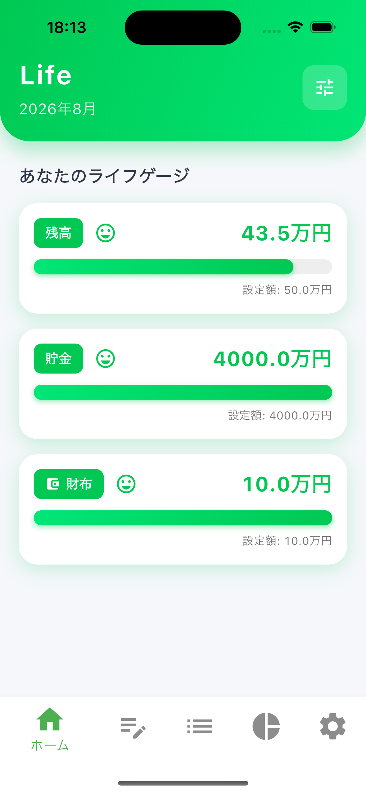
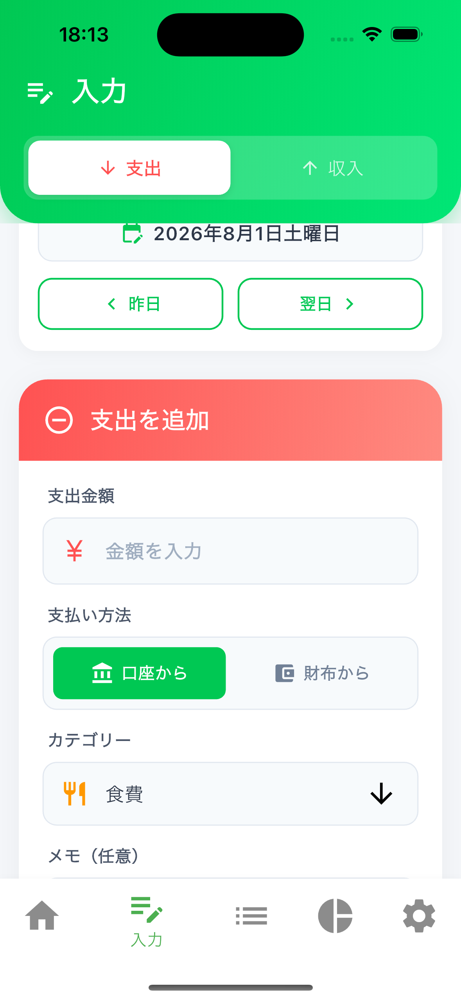
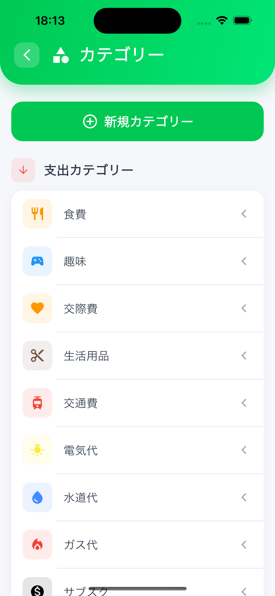

# 家計簿アプリLife

<p align="center">
  
  
  
</p>

<p align="center">
  <a href="https://apps.apple.com/jp/app/id6457262696">
    
  </a>
  
  
</p>

---

## 概要

**家計簿アプリLife**は、ゲームのHPゲージのように残高状況を視覚的に把握できる家計簿アプリです。

従来の家計簿アプリは数字の羅列で「自分が全体の何割使ったのか」が分かりにくいという課題がありました。本アプリは**ライフゲージ**を採用することで、一目で残高状況を理解できるようにしました。

---

## 制作しようと思ったきっかけ

従来の家計簿アプリは金額だけしか表示されないので、自分が全体の金額の何割使ったのかが分かりにくい。

その問題を解決するために、**ライフゲージ**を使うことで、自分がどのぐらいの割合を使っているのかが一目で分かるようにしたかったからです。

---

## 特にこだわったところ

- **ライフゲージを大きく表示** - 自分がどれぐらい使ったのかがすぐに分かるようにしました
- **色で直感的に把握** - 緑（十分）→ 黄（注意）→ 赤（危険）でお金の状況を表現
- **3つのゲージで管理** - 残高・貯金・財布の3つを同時に把握できます

---

## 特に苦労したこと

同じ年と月ごとに支出と収入を分けて、収入が多ければ残高に足す、収入が支出より少なかったらその分を残高から引く処理の実装がとても苦労しました。

また、月が変わった時に自動で残高を貯金に移行する処理や、貯金を切り崩した時の計算ロジックの実装にも苦労しました。

---

## コンセプト

### ライフゲージとは？

ゲームのHPゲージのように、お金の状況を色で表現します。

| 状態 | ゲージの色 | 意味 |
|------|-----------|------|
| 十分 | 緑色 | 余裕があります |
| 半分 | 黄色 | 注意が必要です |
| 少ない | 赤色 | 危険！節約しましょう |

### 3つのゲージ

| ゲージ | 説明 |
|-------|------|
| 残高ゲージ | 今月使えるお金の残り |
| 貯金ゲージ | 貯金の状況 |
| 財布ゲージ | 手元の現金 |

---

## 機能一覧

### 基本機能

| 機能 | 説明 |
|------|------|
| ライフゲージ | 残高・貯金・財布の状況を色分けゲージで表示 |
| 支出記録 | 金額・カテゴリ・メモを入力して支出を記録 |
| 収入記録 | 収入を記録し、貯金・財布への分配も可能 |
| カテゴリ管理 | 支出・収入のカテゴリをカスタマイズ |
| 履歴一覧 | 日付別に支出・収入の履歴を確認 |
| 編集・削除 | 記録した支出・収入の編集と削除 |

### 自動化機能

| 機能 | 説明 |
|------|------|
| 固定支出 | 家賃・サブスク等を指定日に自動入力 |
| 定期収入 | 給与等を指定日に自動入力 |
| 月替わり処理 | 月が変わると残高を自動で貯金に移行 |

### 分析機能

| 機能 | 説明 |
|------|------|
| 円グラフ | カテゴリ別の支出・収入を可視化 |
| 月別推移 | 月ごとの収支を確認 |

### セキュリティ機能

| 機能 | 説明 |
|------|------|
| パスコード | 4桁のパスコードでアプリをロック |
| 生体認証 | Face ID / Touch ID に対応 |

### クラウド機能

| 機能 | 説明 |
|------|------|
| ユーザー登録 | メールアドレスでアカウント作成 |
| ログイン | アカウントでログイン |
| データ同期 | 複数端末間でデータを同期 |
| バックアップ | クラウドにデータを自動バックアップ |

### 通知機能

| 機能 | 説明 |
|------|------|
| リマインダー | 入力忘れを防止するローカル通知 |

---

## 使用技術

### フレームワーク・言語

| 技術 | バージョン |
|------|-----------|
| Flutter | 3.x |
| Dart | 3.x |

### 状態管理

| 技術 | 用途 |
|------|------|
| Riverpod | 状態管理・依存性注入 |
| Freezed | 不変データクラス生成 |
| Flutter Hooks | Reactライクなフック |

### データベース

| 技術 | 用途 |
|------|------|
| SQLite | ローカルデータ保存 |
| Firebase Realtime Database | クラウドデータ同期 |
| Cloud Firestore | クラウドデータ保存 |

### 認証

| 技術 | 用途 |
|------|------|
| Firebase Authentication | ユーザー認証 |
| Local Auth | 生体認証（Face ID / Touch ID） |

### その他

| 技術 | 用途 |
|------|------|
| Google Mobile Ads | 広告配信 |
| Flutter Local Notifications | ローカル通知 |
| Flutter ScreenUtil | レスポンシブデザイン |

---

## アーキテクチャ

**MVVM + リポジトリパターン + Riverpod** を採用しています。

```
UI (Pages/Widgets)
    ↓ ↑
Riverpod Providers
    ↓ ↑
ViewModels (StateNotifier)
    ↓ ↑
Repositories
    ↓ ↑
Databases (SQLite / Firebase)
```

---

## ER図


---

## インフラ構成図


---

## 対応プラットフォーム

| プラットフォーム | 対応状況 |
|-----------------|---------|
| iOS | 対応（iOS 12.0以上） |
| Android | 対応予定 |

---

## ダウンロード

<a href="https://apps.apple.com/jp/app/id6457262696">
  
</a>

---

## 開発者向け情報

開発者向けの詳細なドキュメントは [CLAUDE.md](CLAUDE.md) を参照してください。

### セットアップ

```bash
# リポジトリをクローン
git clone <repository-url>
cd budget_life

# 依存関係をインストール
flutter pub get

# コード生成（Freezed）
flutter pub run build_runner build --delete-conflicting-outputs

# アプリを実行
flutter run
```

### ビルド

```bash
# iOS リリースビルド
flutter build ios --release --no-tree-shake-icons

# Android リリースビルド
flutter build apk --release
```

---

## プロジェクト情報

| 項目 | 内容 |
|------|------|
| アプリ名 | 家計簿アプリLife |
| デベロッパ | keito isobe |
| バージョン | 2.0.1 |

---

## ライセンス

Private - All Rights Reserved
